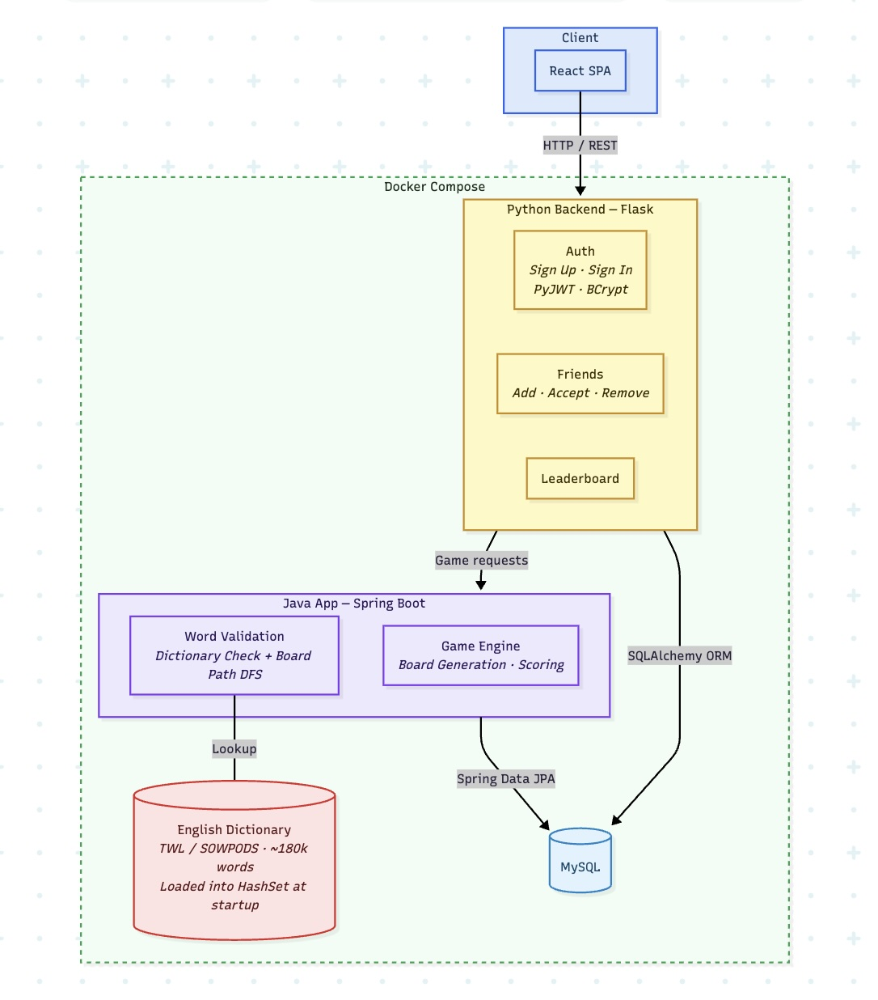
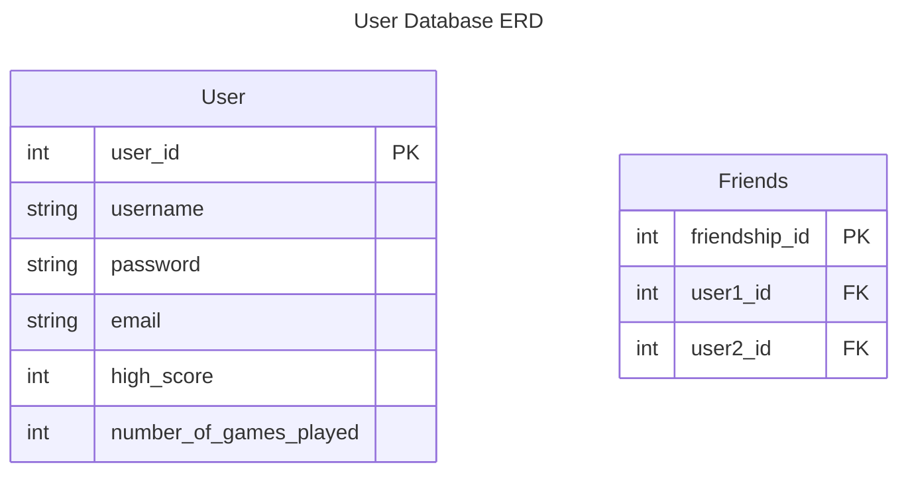
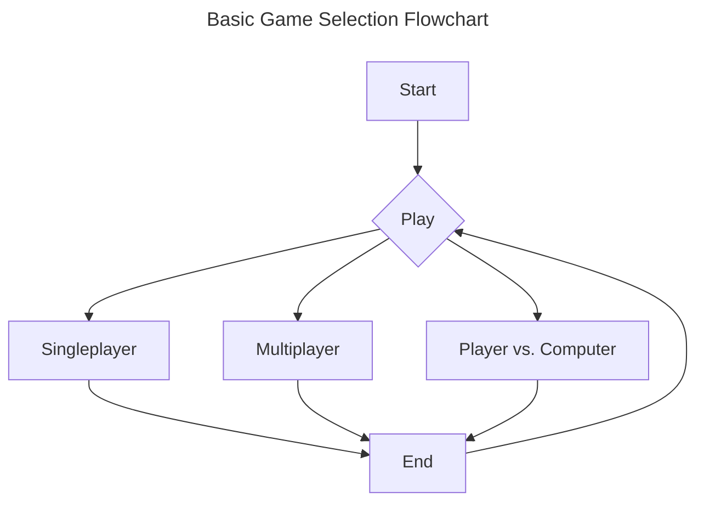
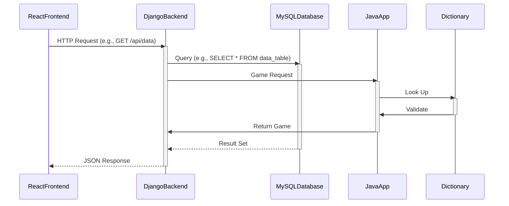

## UWoggle

### Project Abstract

<!--A one paragraph summary of what the software will do.-->

A basic application of the game Boggle. Users will be able to participate in real-time games with other users. There will be an algorithm to randomly shuffle the letter dice and lay them out; an interface for entering your words; a scoring feature displaying everyone's wordlists and highlighting unique entries; etc.

Additional features may include customizable game settings, user accounts, tracking user stats, playing against a computer, and the ability to design custom boards for others to play, choosing different alphabets, incorporating a shared "definitive" dictionary, etc.

### Customer

<!--A brief description of the customer for this software, both in general (the population who might eventually use such a system) and specifically for this document (the customer(s) who informed this document). Every project will have a customer from the CS506 instructional staff. Requirements should not be derived simply from discussion among team members. Ideally your customer should not only talk to you about requirements but also be excited later in the semester to use the system.-->

The customer is anyone who wants to have fun with this word finding game.
Our main customer is someone from the CS506 instructional staff.

### Specification

<!--A detailed specification of the system. UML, or other diagrams, such as finite automata, or other appropriate specification formalisms, are encouraged over natural language.-->

<!--Include sections, for example, illustrating the database architecture (with, for example, an ERD).-->

<!--Included below are some sample diagrams, including some example tech stack diagrams.-->

#### Technology Stack

#### Database

#### Class Diagram

#### Flowchart

#### Behavior

#### Sequence Diagram

### Standards & Conventions

<!--This is a link to a seperate coding conventions document / style guide-->

[Style Guide & Conventions](STYLE.md)
